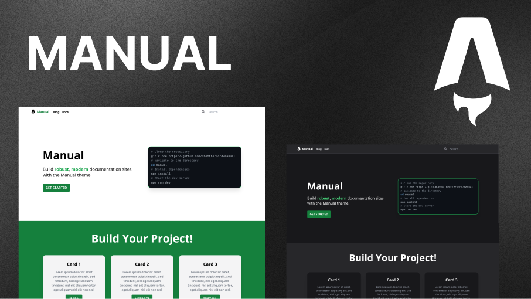

<!--  -->

## 🚀 Getting Started

## 📚 Features

## 📁 Project Structure

Inside your project, you'll see the following useful folders and files:

```
/
├── public/
│   └── favicon.svg
├── src/
│   ├── components/
│   │   └── Navigation.astro
│   ├── content/
│   │   ├── blog/
│   │   ├── docs/
│   |   └── config.ts
│   ├── layouts/
│   │   ├── Base.astro
│   │   ├── Blog.astro
│   │   └── Docs.astro
│   ├── lib/
│   ├── pages/
│   │   ├── blog/
│   │   |   ├── [id].astro
│   │   |   └── index.astro
│   │   ├── docs/
│   │   |   └── [...id].astro
│   │   ├── images/
│   │   |   └── [...id].png.ts
│   │   ├── 404.astro
│   │   ├── index.astro
│   │   └── rss.xml.ts
│   └── site_config.ts
├── astro.config.mjs
├── package.json
```

Content is stored in the `src/content` folder. This is where you'll find your documentation (`docs/`), and configuration (`config.ts`). The `config.ts` file is where the frontmatter type definitions are made.

OpenGraph images are procedurally generated from the `src/pages/images` folder. You can change the default image by editing the HTML defined in `src/pages/images/[...id].png.ts`.
